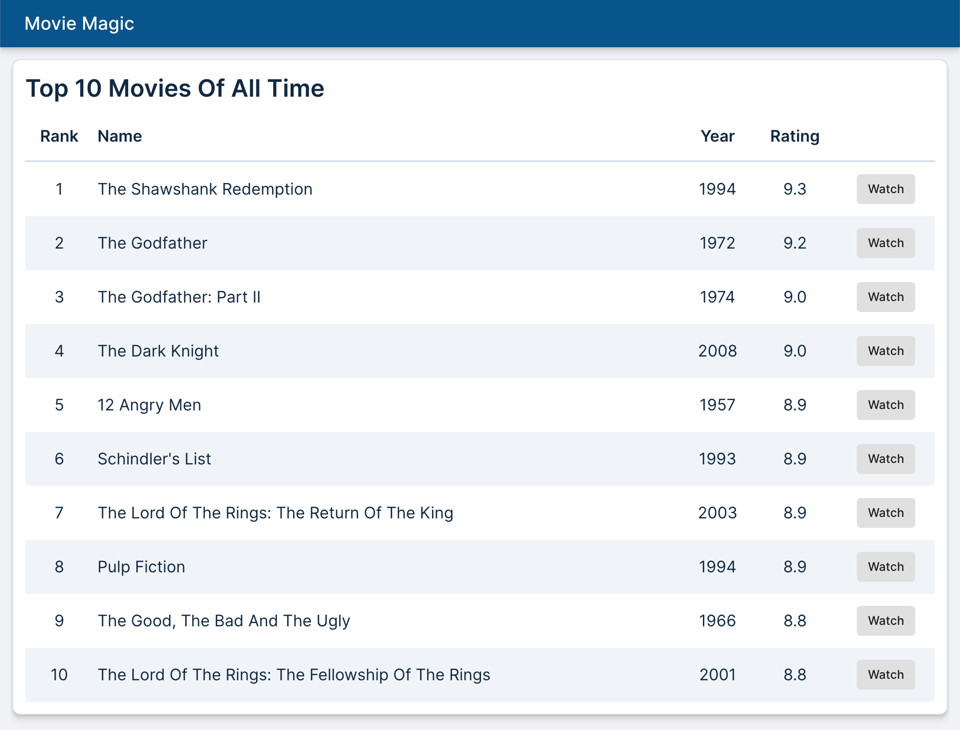

# Movie Magic

An example of using Code Shaper to generate a React app. To see step-by-step
instructions to create this app, visit
[Getting Started](https://www.code-shaper.dev/docs/getting-started/overview) in
Code Shaper docs.



## Building Movie Magic

### Development Build

```shell
# In the root directory, install dependencies
npm ci

# Run the app
npm run dev
```

Open browser windows at each of the following URLs to see the respective demo
apps:

1. http://localhost:3000/: Movie Magic | React
2. http://localhost:3001/: Movie Magic | Next.js (Under construction)
3. http://localhost:3002/: Movie Magic | Remix (Under construction)

Note that the React app fetches mock data from MSW, whereas the other two apps
fetch real data from the movie-magic-api.

> Note: Do not run `npm install` or `npm ci` in any of the subdirectories. It
> will break the build. There should be only one `package-lock.json` file in the
> entire repo (at the root).

### Production Build

To build all apps and packages, run the following command:

```shell
npm ci
npm run build
```

### Clean Build

Removes all build artifacts and performs a clean build.

```shell
npm run clean
npm ci
npm run dev
```

For an "aggressive" clean build, add one more step as shown below. This will
build the lock file from scratch.

```shell
npm run clean
rm package-lock.json
npm install
npm run dev
```

## Running Storybook

```shell
# Install Storybook dependencies
cd storybbok
npm ci
cd ..

# Run Storybook
npm run storybook
```

## Running Unit Tests

```shell
npm test
```

## Running End-to-End Tests

```shell
npm run dev # starts a local server hosting the react app

# run cypress in a different shell
npm run cypress
```

## Code Formatting

```shell
npm run format
```

## Running the Custom Plugin

If you have not installed Code Shaper, first install it:

```shell
npm install -g code-shaper
```

Now build and run the React Patterns plugin

```shell
npm run build

shaper
? Which plugin would you like to run? React Patterns
? Which generator would you like to run? fetch-hook
? What are you fetching? Orders
? What is the return type? Order[]
? Parent directory? apps/movie-magic/src/pages/HomePage

Creating useOrders...
  useOrders.ts
```
